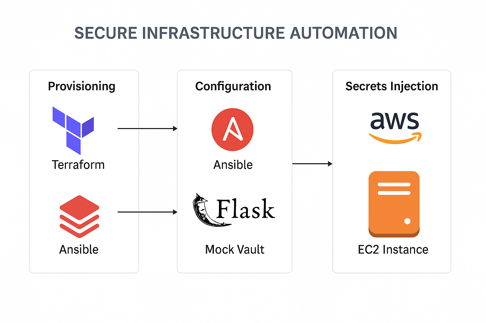

# 🔐 Secure Infrastructure Automation with Bash, Ansible, and Terraform

This project demonstrates secure, automated provisioning of cloud infrastructure using Terraform, configuration management with Ansible, and secret injection from a mock CyberArk vault API written in Flask.

It fully automates the lifecycle of a virtual machine, configures essential software, securely retrieves secrets, and stores them on the provisioned EC2 instance — all via a single command.

---
### 📸 Architecture


---
### 🧰 Tech Stack

- **Terraform** – AWS EC2 + Security Group provisioning
- **Ansible** – Apache setup, user creation, secret injection
- **Flask** – Mock Vault API simulating CyberArk
- **Bash** – End-to-end automation with `provision.sh`
- **AWS** – EC2, Security Groups
- **Secrets** – Injected via API and stored securely as `secrets.env`

---

### 🚀 One-Command Deployment

```bash
cd scripts
./provision.sh
```
---

### What Happens When You Run the Script?

- **Provision Infrastructure:** Launches an EC2 instance and configures security groups using Terraform.
- **Start Mock Vault:** Runs a Flask-based API to simulate CyberArk for secret management.
- **Inject Secrets:** Retrieves secrets (e.g., database credentials) from the mock vault and securely stores them on the EC2 instance.
- **Configure Server:** Uses Ansible to install Apache, create a `devops` user, and apply additional configurations.
- **Logging:** Captures all output and errors in `logs/provision.log` for easy troubleshooting.This will:

## Project Structure

```pgsql
secure-infra-automation/
├── terraform/             # Terraform EC2 + SG provisioning
├── ansible/               # Playbook to configure instance
├── vault_mock/            # Flask app simulating secret vault
├── scripts/               # Wrapper + secret fetcher
├── logs/                  # Execution logs
├── vm_ip.txt              # Terraform-generated public IP
└── README.md              # You're here!
```
## 🔒 Secure Secret Injection

- The Flask app simulates a secret manager with token-protected /get-secret API.
- The Ansible playbook uses a local script (fetch_secret.sh) to securely fetch and copy secrets to the EC2 instance.
- Secrets are stored as /etc/app/secrets.env with strict 0600 permissions.

### 🧪 How to Verify

- SSH into EC2:
```bash
ssh -i ~/.ssh/your-key.pem ec2-user@$(cat vm_ip.txt)
```
-  Check Apache
```bash
sudo systemctl status httpd
curl http://localhost
```
- Check Secrets:
```bash
cat /etc/app/secrets.env
```
- Check User:
```bash
id devops
```

## 📌 Notes

- The Vault Flask app must run locally on port 5050 when using provision.sh

- This simulates production secret injection using CyberArk or Vault

- The project is intentionally simplified to run entirely from your local machine